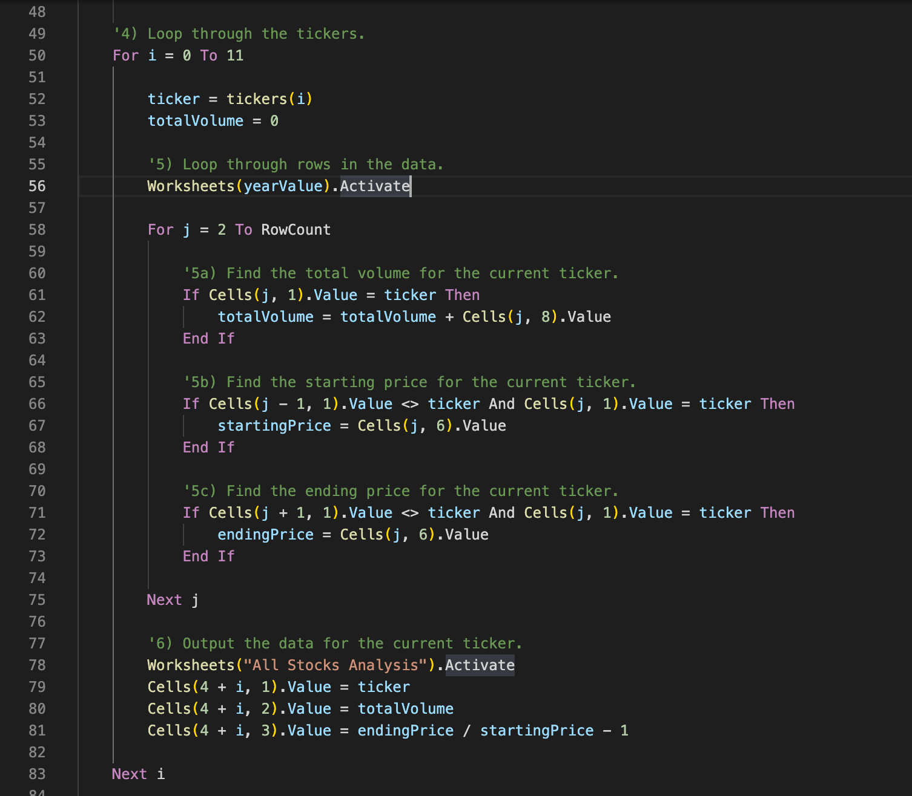
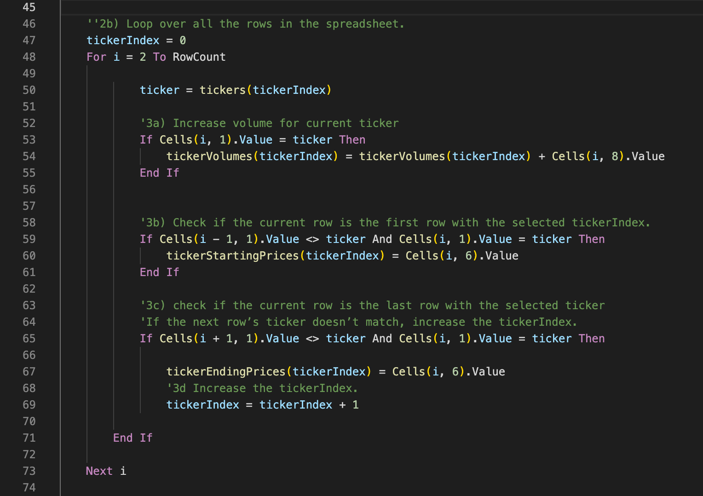

# All Stocks Analysis

---
## Overview of Project
The initial requirements for this analysis were to help Steve determine which green energy stocks would be the best ones for investment.

After running a report on green energy stocks, Steve requested a more robust analysis to see if there were opportunities in other sectors that would be prove to be worth investigating further.

Once the requirements changed to allow Steve to analyze all stocks and would require the system to run through thousands of stocks, it became apparent that the code needed to be much more efficient.

The goal of this project is to take the original green_stocks analysis and refactor the code to be much more efficient.

Since we will be going through the code and making some significant changes we will also be looking for ways to improve readability for future enhancements and maintenance.

---
## Results

The following screen shots show results of running the reports on both 2107 and 2018 data both before and after refactoring.

### 2017 Results Before Refactoring

### 2017 Results After Refactoring

### 2018 Results Before Refactoring

### 2018 Results After Refactoring

### Code Changes
(TODO: Add information on the changes that were needed to eliminate the extra for loop. i.e. 1: new arrays to hold the data being sumarized with a png of the arrays and 2: describe about how the index var was used to traverse the arrays.)

#### New Arrays
In order to use one loop, we need to store the values we retrieve by ticker.  To do this an index and 3 arrays were defined before starting the loop as shown in figure 1 below:

This image shows the for loop before refactoring. In this code we can see that having nested for loops will run the code in the inner loop i * j times, or a factor of N^2:

This image show shows the for loop after refactoring. In this code we can see that the total number of times we run through the array will be equal to the number of rows of data in the spreadsheet, or a factor of N:

---
## Summary

After an analysis of the code it became apparent that the nested loop could be performed with just one iteration through the arrays. By doing this the number of iterations is cut from N^2 to N. (Note: I do not remember this formula exactly however an exponential number of steps is very costly compared to a linear number.

The numbers from the images above were placed in a new spreadsheet named "Summary" in the VBA_Challenge workbook to show the following:

From the image above we can see that refactoring saved more than 4 tenths of a second! While this does not seem like much, with only 3K rows, this is a great improvement.  With tens of thousands of rows this would quickly make a huge differnce.

Some future enhancements to this project would be to automate the creation of the summary sheet and to run it several times to get a larger sample of data to work with. This will be more important in an enterprise type system that will be changing often and could be included as part of the testing process.

### Pros of Refactoring
- Eliminating nested loops can exponentially reduce the time it takes for a proram to run
- Cleaning up the code with subroutines, comments, etc. will help developers and testers to maintain and test the software

### Cons of Refactoring
- Refactoring can take an extensive amount of time and can be a huge commitment depending on the size of the system and the resources available to do it.
- Any code changes can add bugs. When refactoring, some large differences may be made in a way that makes it hard to debug depending on the process that is set up for developing and maintaining software.

### Pros and Cons around Refactoring for the Challenge
- In Excel VBA's editor, it will often come up with a generic message stating that the value of an object or variable is out of range.  This can take time getting used to understanding how to find this error. Most likely some variable sent to determine a Cell on a worksheet is out of range either because it was not initialized. Another possibility is that the value went over the array boundaries.  In either case, the program will seem like it stopped running but if the stop button is not pressed the program will try to continue where it stopped and it will continue to fail. Once the stop button is pressed, the program will reset so it runs from the beginning with the updated code. This happened for a while where it was unclear why changes to the program did not take effect and took more time up than it should have.
- At first when I added a new subroutine to format data it was not working but when I went back to it, I noticed I needed to pass in some variable that were no longer being set and that fixed the problem.  By putting the formatting in a separte routine, it not only cleans up the loop that sets the data it also makes updates to formatting easier in future releases.  Since it only adds 1 iteration through the data vs. an exponential number it should not affect performance making code readability more important.
- Another observation after going back to green_stocks, I saw the subroutine that is working there for formatting.  I do not know why I need to use Call to run the subroutine I created but I will look into that later. The error I recieved without it was a syntax error. It is funny I forgot about the subroutine we put in during the modules but it proved helpful to find it so I could see some other problems with the subroutine that I wrote and was able to fix. One difference is that mine takes arguments but I cannot see that being the syntax error though it could be but I will have to address that at a later time.
- Though it did take a lot of time to refactor considering the size of the project, this will become easier with time and the new code made a significant improvement in time to run.
